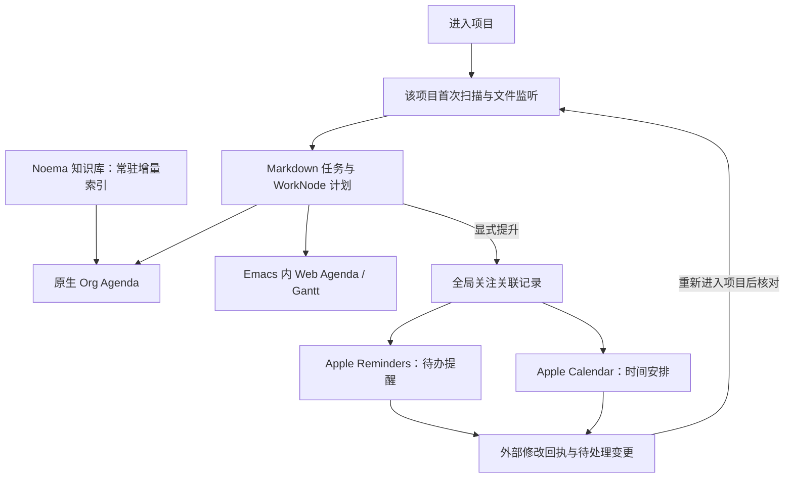

# Noema × Org Agenda：知识库、项目 DAG 与 Apple 全局关注

研究日期：2026-09-15。本文保留研究时的设计与实验边界；2026-09-16 起的生产接入进度见
[实装记录](agenda-implementation.md)。目前已经实现原生基础视图、scope API 和 WorkNode 元数据，完整系统仍在实装。

## 1. 结论与本轮确认的边界

采用 **Org Agenda 为主要交互、Noema 文档为权威源、按作用域索引、显式提升到 Apple** 的模型。

用户本轮确定的要求：

1. 尽量复用 org-agenda 的代码和 UI，日常设计向 Org Agenda 看齐。
2. Markdown 编辑器、Roam、org-env、Web Agenda、AI 工作树使用贯通的任务模型。
3. DAG 的 WorkNode 可以安排日程、截止日期、优先级并进入 Agenda。
4. 性能优先，不采用定时轮询来发现文件或 Apple 数据变化。
5. **只有 Noema 知识库常驻索引；其他项目进入后才扫描。**
6. **项目任务需要全局关注时，显式注入 Apple Reminders / Calendar。**
7. **最终实装原生读取 Noema 数据，不生成临时 `.org`，不使用 Org 镜像。**

因此：离开项目不意味着它的全部任务继续进入常驻全局索引。
需要跨项目持续提醒的对象由显式提升产生，Apple 侧维持全局可见性；
Noema 仅保留这些对象的轻量关联与待处理同步记录。

当前 `AGENTS.md` 保护 Emacs-hosted Web Agenda；新增原生 Agenda 与其兼容。
配置文档中“Web 是唯一 Agenda UI”的旧表述将在生产切换时更新。
本研究不修改已有项目设计决策或现行快捷键。

## 2. 现有实现能直接利用什么

| 模块 | 源码依据 | 接入价值 |
|---|---|---|
| Markdown 编辑器 | `src/cm6/editor-cm6.ts` | 源文、位置、可视 widget 已统一；Agenda 不另建可写文档副本 |
| Planning DSL | `shared/planning-dsl.mjs`、`planning-values.mjs`、`planning-semantic.mjs` | 已有 `@@todo/itodo/project/milestone/clock`，别名、日期、重复、源文补丁 |
| 任务语义 | `kernel/noema/planning/semantic.go`、`kernel/noema/agenda/agenda.go` | Go 已有语义写入、依赖、日程、项目汇总、计时模型 |
| Node 服务 | `server/lib/runtime.mjs` 的 `extractTodos/buildAgenda/patchTodo/clockIn` | 已有扫描缓存、串行保存和 provider 分派，原生 UI 应调用这里的现有能力 |
| Web 更新 | `web-host.mjs`、`aaronnote/agenda-view.ts` | 已有 `agenda-changed` / `notes-index-changed` 推送、隐藏视图不刷新 |
| Emacs 入口 | `lisp/roam/init-md-roam.el`（AaronEmacs） | 已有任务定位与 Web Agenda 入口，适合增加原生 dispatcher |
| org-env | `shared/block-identity.mjs`、`block-properties.mjs` | 定理、证明等环境已有 UUIDv7 身份与属性；可以成为任务上下文 |
| 工作树 | `kernel/noema/research/notebook.go`、`server/lib/research-notebook.mjs` | WorkNode 与 Cell 分离，`lineage` 与 `depends` 已有独立边类型 |
| AI 语义 API | `lisp/noema-api.el` | `noema-open-node`、`noema-run-cell` 等可供 Agenda 跳转与执行复用 |

几个需要补齐的接口缺口：

- `buildAgenda` 当前主要消费 Markdown planning；WorkNode 的 Go 结构没有计划字段。
- `kernel/mcp/tools/todo.go` 的 `todo_write` 是 **Agent 会话内清单**，不是知识库 Agenda。
  不能把它直接当成持久任务 API，更不能据此把模型输出全部导入日程。
- `getTodos/buildAgenda` 依赖现有扫描上下文；多项目并存需要显式 `scopeId`，
  避免某个 buffer 切换项目后影响另一个 Web 或原生视图的数据源。
- Web 已有基于短时间窗的自身写入回声抑制。生产统一时改为 mutation ID / revision，
  防止恰好落入同一时间窗的独立外部编辑被跳过；这不是当前轮次已修复的功能。

## 3. 上游 Org 源码审查与复用方式

已克隆完整工作树到 `upstream/org-mode`：

```text
repository: https://git.savannah.gnu.org/git/emacs/org-mode.git
revision:   9f8be52a3b58516b1b6d829fea4e0ee68db6b602
version:    10.0-pre
local:      Emacs 31.0.91 / bundled Org 9.8.7
```

这是研究 checkout，不加入默认 load-path。`make autoloads` 后以独立 batch
进程测试克隆版；当前 Emacs 的 Org 不被替换。上游工作树未修改。

### 3.1 为什么不能仅拷贝 org-agenda.el

[`org-agenda.el`](../../upstream/org-mode/lisp/org-agenda.el) 直接依赖 Org、
org-element、fold、refile 等模块。关键函数实际执行的是：

- `org-agenda-get-day-entries` 检查文件存在，要求源 buffer 派生自 `org-mode`，
  然后分别提取 scheduled / deadline / timestamp 等条目。
- Agenda 行的 `org-marker` / `org-hd-marker` 指向 Org 源文。
- `org-agenda-todo` 跳到该 marker，调用 `org-todo`，并设置 `inhibit-read-only`。
- schedule / deadline / priority / clock 命令同样回到 Org 源文进行操作。
- `org-agenda-redo` 重建 major mode，会丢弃普通 buffer-local 适配状态。

因此，最终方案不调用 Org 的源文扫描/写入链。Agenda 行携带原生 Noema
`AgendaItem/sourceRef`，需要定位时才解析真实 Markdown/WorkNode 地址。
不伪造指向镜像的 `org-marker`，也不让 Org 的 clock 命令影响无关的 Org 文档。

### 3.2 最终选择：原生 Noema backend + Org Agenda 界面组件

| 方案 | 结论 |
|---|---|
| 所有 Markdown 改成 Org 标题与属性抽屉 | 不采用；保留现有文档语法 |
| 临时转换成 `.org` 或内存中的 Org 文本再供 Org 扫描 | 用户明确排除；研究原型已经移除此路径 |
| 从零仿写一个 Agenda UI | 不采用；尽量复用已成熟的上游代码 |
| **原生 Noema 记录直接交给 Org Agenda 的格式、排序和界面组件** | 最终推荐方向，已通过隔离原型验证 |

```text
Markdown / org-env / WorkNode
  → Noema scoped index + agenda query
  → typed AgendaItem / occurrence records
  → Org Agenda formatting, sorting, faces, navigation
  → Emacs native Agenda buffer
```

这意味着“复用 Org Agenda 的实现”不等于“调用 org-agenda-list 扫 Org 文件”。
将上游与存储无关的部分直接调用；耦合源格式的部分放在 Noema 自己的数据后端与命令适配层。
完整上游 checkout 保留供审查，产品模块使用 `noema-agenda-*` 命名，不用全局 advice
改变用户正常的 Org 行为，也不通过全局覆写 Org 函数偷换来源。

原型已经直接复用：

- `org-agenda-mode`：原生 major mode 与 faces。
- `org-compile-prefix-format` / `org-agenda-format-item`：分类、时间和条目格式。
- `org-agenda-format-date-aligned`：原生日期标题。
- `org-agenda-finalize-entries`：条目排序、TODO 字体和串接。
- `org-agenda-next-line/previous-line`：基础键盘移动。
- `org-agenda-filter-hide-line`：过滤后的原生文本可见性。

不能原样继承的入口需逐个适配：

| Org 接口 | 原生 Noema 接入方式 |
|---|---|
| `org-agenda-list/get-day-entries` | scope query 返回 day buckets/occurrences，直接渲染，无 Org 文件扫描 |
| `org-agenda-todo-list/tags-view/search-view` | 查询 Noema 索引，复用列表结构、标签筛选与组合视图设计 |
| `org-agenda-goto/switch-to/show` | 通过 sourceRef 打开真实 Markdown、CM6 或 JuText/Graph |
| TODO/schedule/deadline/priority | 保留交互方式和日期选择 UI，写入现有 semantic mutation |
| clock/capture/refile/archive/undo | 按源类型适配为 Noema 命令；未适配前不继承会写 Org 的入口 |
| redo / 周期切换 | 重新执行当前 scoped query，按 record ID 重绘；不调用 Org 的扫描 redo |
| 原生 filter 对 `org-marker` 的假设 | 遍历 `noema-item`，复用匹配/隐藏逻辑，不伪造 source marker |

所有任务都使用源对象身份，多个日期行共享对象 UID，另有 occurrence key。
可以复用纯粹的排序 comparator，涉及 Org 原始属性读取的 comparator 则从记录读取同义字段。
如需提取少量上游逻辑，保留来源、revision、许可证和契约测试；不逐步复制整套 Org parser。

复用优先顺序是日/周、TODO、过滤、日期导航、自定义组合视图，随后补齐批量操作、
捕获、归档、撤销与 clocktable。habit 与复杂列视图单独设计；不能宣称继承 major mode
就自动兼容全部 Org 插件。

组合 Agenda 的设计依据见 [Org 官方手册](https://orgmode.org/manual/Custom-Agenda-Views.html)。
上游源文写回行为参见 [Agenda Commands](https://orgmode.org/manual/Agenda-Commands.html)。

### 3.3 语义以 Org 为参照，Noema 原生服务统一求值

Noema semantic service 继续拥有持久变更和跨界面求值；Org 作为功能与语义参照。
同一个任务不能在 Go 和 Emacs 中各自推进重复日期：

- 用共用 fixtures 对齐 `+` / `++` / `.+`、scheduled、deadline warning、
  逾期、日志、优先级和日期边界，记录明确的兼容差异。
- deadline warning 天数、完成项目是否显示等配置形成共同 Agenda profile。
  用户的任意 Org 全局配置不能悄悄改变 Web 与原生的任务结果。
- Noema 查询返回重复 occurrence、依赖阻塞、外部只读事件；原生 UI 与 Web 消费同一结果。
  显示层不再次展开重复，也不通过日期到达自动执行 Agent。
- UI 需要的日期选择、prefix formatting 等成熟代码继续复用；现有 Markdown 的
  原文、别名和多行结构由原生 planning patch 保持。

## 4. 统一对象模型：任务、研究节点、时间安排

### 4.1 统一读取接口，而不是合并所有身份

建议 `AgendaItem` 至少包含：

```text
uid, scopeId, sourceKind, sourceRef, revision
title, state, effectiveState, scheduled, deadline, priority, effort, tags
dependencies, contextRefs, availableActions
runStatus?, outcome?, externalBinding?, pendingSync?
```

- Markdown 任务：`scopeId + source document ID + planning stable ID`。
- WorkNode：`project ID + notebook ID + work_node_id`；不是 Cell ID。
- 日期 occurrence：`itemUid + occurrenceKey`，同一任务可以在多个日期展示。
- Apple 镜像：绑定上述 UID，显示时合并；外部事件是独立的只读覆盖项。
- 未提升、未建立跨文档关联的临时 Markdown 任务可沿用位置 ID；一旦提升、
  链接或计时，调用现有 `ensureTodoId`。不能把扫描位置当成跨设备长期身份。
- 原型的 UID 使用绝对路径参与哈希，足以验证本地投影；生产需文档/项目身份，
  文件重命名不能改变外部关联。

### 4.2 Markdown 保留现有语法

```md
@@todo(doing) [检查定理假设] {
  id: proof1
  sche: 2026-09-16
  ddl: 2026-09-18
  prio: A
  effort: 90m
}
```

保留当前别名和多行写法；日期输入、重复器以及操作习惯向 Org 看齐。
不要求用户写 Org 标题、`SCHEDULED:` 或 properties drawer。
选中文本 capture 为任务、Agenda 中 `t/s/d/p/I/O` 等命令均调用现有语义 API。
“完成”走 `op: complete`，不能简单 `status=done`，否则绕过重复与完成日志。

### 4.3 WorkNode 的计划信息：JuText 中可见、节点身份归属

最终实现直接复用 Markdown 的 `@@todo`/`@@clock` 语法，不引入 `@@agenda`，
也不要求用户编辑隐藏 JSON：

```text
%% work 探索谱方法证明
@@todo [探索谱方法证明] {
  sche: 2026-09-16
  ddl: 2026-09-18
  prio: A
  effort: 90m
}

请从可逆算子的条件出发……
```

该计划区就是 JuText 可直接编辑的原生来源。索引按 WorkNode ID 归属计划，运行
Agent 时剥离前导 `@@todo`/`@@clock`，prompt、output、cell 和 DAG 均保持原样。
结构编辑、Agenda 写回和直接文本编辑使用同一 round-trip 约束。

一个 WorkNode 绑定多个 Cell，仍然只有一份计划；相同计划可以在各 Cell 显示，
同一次编辑必须原子更新同一节点。无 Cell 节点从 Agenda 打开 Graph/Inspector。
只有加入计划的节点进入任务行；Web Agenda 的 DAG 是整个已进入项目的投影，
所以无计划、无 Cell 的 WorkNode 仍出现在 DAG 中，并可回到 Graph/Inspector。

状态映射用于显示：`open→TODO`、`active→DOING`、`waiting→BLOCKED`、
`done→DONE`、`dropped→CANCELLED`。同时保留原始 state 与 outcome：

- Run 完成不等于研究节点完成；结果可能需要人审阅。
- 完成工作节点应更新现有 WorkNode state；不另存一个独立任务完成状态。
- `lineage` 表示探索来源，不能自动阻塞后代；`depends` 才参与就绪判断。
- WorkNode 被 dropped 不等于其证据要求已满足。跨域依赖要明确“完成即满足”还是
  “指定 outcome 才满足”，不能直接沿用 Markdown cancelled 的解锁规则。
- Dag 分支不自动变成定时执行器；到期只提醒，启动 Agent 仍通过现有 RunSpec/ACP 入口。
- 重复性研究工作先限制为显式创建后续节点/occurrence；不要每周重置一个已有
  checkpoint 或覆盖历史 DAG。普通 Markdown 重复任务继续用已有机制。

### 4.4 org-env 与知识关联

推荐把任务留在对应 theorem/proof/note 环境内部，利用环境已有的块 ID 作为上下文。
原型已经验证环境内部 `@@todo/@@itodo` 能通过现有扫描入口进入原生 Agenda。

环境的 `status=draft`、`phase=proof` 是知识属性，不自动等价于任务状态。
需要管理整个证明时，用显式的“为此块建立任务/关联 WorkNode”操作保存关联。
新增 `contextRef` 一类属性需要同时扩展 DSL 白名单、Go/JS parser 和 patch contract；
不能只在 UI 偷加一个目前会被报为 unknown-key 的字段。

来源范围使用现有结构索引定位。meta summary、代码字面量、导入内容、Agent outputs
中的伪 `@@todo/@@clock` 不得自动变成持久任务；Agent 提议经采纳后才创建正式对象。

## 5. 扫描范围和全局关注：按用户最终模型



| 作用域 | 首次读取 | 后续变化 | 离开后的策略 |
|---|---|---|---|
| Noema 知识库 | 宿主启用时建索引；可先显示已有缓存 | 文件事件触发增量更新 | 常驻，不因项目切换停止 |
| 普通项目 | 明确进入/打开项目工作空间时 | 仅活动项目有监听；限定后缀与目录 | 最后一个使用者退出后关闭监听，保留可重建缓存 |
| 已提升的全局关注项 | 用户执行提升时创建绑定 | Apple 变更通知更新轻量镜像/回执 | 不因此重新扫描项目 |
| 未激活项目 | 不读取内容 | 不创建监听、不做后台发现 | 旧快照默认不混入当前任务列表 |

`my/project-switch`/workspace 生命周期是集成点；访问同项目的多个 buffer 使用
引用计数，不重复扫描。活动 Run 可暂时持有项目生命周期引用，其结束后释放。
知识库内的项目子目录应复用同一文件索引；同一路径在多个 scope 显示也只索引一次。
`~/`、所有历史 project 列表和所有 Git 工作树都不能成为隐式扫描根。

实现沿用 AaronEmacs 的 Remote framework：sourceRef 携带 target/规范 URI，项目扫描、
watcher 和宿主通道走现有 gateway/provider，而不是在新模块硬编码本地绝对路径。
远程项目同样只在进入时索引；后端没有可靠通知时显示待刷新并支持手动核对，
不新增 SSH 轮询。Apple helper 固定在用户的 macOS 客户端，与项目所在 target 分离。
相关配置进入已有 `config` 注册表和 Noema 配置面，不再新建一套配置文件/管理页面。

重新进入项目可以先展示该项目缓存并标记正在核对，再进行一次该根范围的扫描。
只要未在后台监听，不能假设旧缓存完整反映离开期间的变化。大项目按批处理，
首屏不等待所有文件完成；文件错误与扫描进度可见。

### 全局提升的具体语义

- 命令“提升到全局关注”选择 Reminders、Calendar 或两者，并创建唯一 binding。
- 普通 deadline 不自动变成占用一整天的 Calendar 事件；Calendar 需要明确时间块，
  或用户明确选择 all-day 日期标记。多次时间块属于同一任务的多个安排。
- 仅已提升对象出现在跨项目关注面；从 Apple 返回的行可以在 Emacs 全局关注视图显示，
  它们不代表背后的全部项目被激活。
- 项目关闭期间在手机完成提醒：记录远端完成事实和本地 pending receipt，
  不声称已经改好 `.md/.noema`。下次进入项目，用基准 revision 核对后写回。
- 点击“打开源项目”是一次明确的激活操作，可以触发项目扫描。
- 取消全局关注只取消外部绑定/安排，保留项目任务和研究 DAG。
- 未开启 Apple 集成时，提升入口明确显示不可用；不暗中替换成全项目后台索引。

## 6. 无轮询的变更链与性能预算

### 6.1 事件驱动

```text
文件保存 / fs.watch / Emacs file-notify / 项目进入 / Apple store change
  → scope dirty set（合并同一批变化）
  → 单次异步解析或限定查询
  → semantic revision + affected item IDs
  → 可见视图局部更新；不可见视图只记 dirty
```

- 不使用周期 `setInterval` / `run-at-time ... repeat` 来检查任务、目录或 Apple 数据。
- 有事件时才设置一次性的合并延迟，例如 100–250 ms；闲置时没有待执行扫描任务。
  这类事件合并不是周期轮询。
- IPC 使用已有宿主通道；不能在每个任务或每次按键时启动 Node/Swift 子进程。
- 同一 scope 只允许一轮解析在途；期间再次变脏只合并进下一轮，防止风暴产生并发全扫。
- 原子保存的 rename/delete/recreate 需重挂监听；监听溢出/丢失状态标记不可信，
  在下次激活或显式刷新时做一次限定范围重建，不加永远运行的兜底轮询。
- 原生/网页响应带 scope、query generation 和数据 revision，拒绝迟到的旧结果。
- 日期变化不是文件变化：可见 Agenda 只预约下个本地午夜的一次唤醒；系统唤醒、
  时区变化、窗口重新可见时核对日期。这里不能以固定 86,400 秒代替日历日期推进。
- 计时视图按开始时间推导耗时；隐藏时不刷新。计时显示重绘不扫描任务、不拉取 Apple 数据。
- 上游 Agent lease、网络 heartbeat 是其他子系统的存活机制；本研究不擅自移除它们，
  也不把“没有 Agenda 查询轮询”宣传为整个 Emacs 从此没有 timer。

### 6.2 原生视图查询和重绘也必须有界

原生方案不进行 Org 转换。即便没有转换，也不能每个按键都在主线程重画所有任务。
生产要先用索引选择当前 scope/query 的对象：

1. 时间视图覆盖显示窗口、逾期项、deadline 预警、重复 occurrence，以及过滤所需数据。
   不能仅筛选“日期刚好在这周”的任务，否则丢失 Org 风格的逾期和预警行为。
2. TODO/search/tag 视图按匹配集合与分页读取；大型结果显式显示总数与加载范围。
3. 按 scope/视图缓存结构化记录与行区间；变化时按 UID 更新受影响条目，保留选择、
   展开和过滤状态。一次项目切换不重建无关知识库视图。
4. 批量修改按事务组提交，统一发一次变更摘要；撤销是源层补偿命令。
5. Web 与原生消费同一 query profile、occurrences 和 mutation API。

本地基准见 [原始结果](../../poc/org-agenda/benchmark-result.json)。
使用 Emacs 31.0.91 / Org 9.8.7，预热后分别渲染 100、1,000、5,000 个同日任务，
每档三次；包含原生记录分组、上游格式/排序函数、7 天 Agenda 文本构建与清理。
不含知识库扫描、IPC、真实 GUI 绘制或 Apple 同步，没有 Org 文件生成/读取。
这个实验用于测量直接渲染的成本，不是生产性能承诺。

| 原生记录数 | 完整周视图构建中位耗时（三次） |
|---|---|
| 100 | 4.0 ms |
| 1,000 | 59.6 ms |
| 5,000 | 273.9 ms |

这也说明即使直接复用 native formatter，5,000 条全量重绘仍不适合每次输入触发。
正式版本必须使用按范围查询、增量行更新和可见性门控。

建议的验收目标（待实际实现后测量）：

| 情景 | 验收条件 |
|---|---|
| 闲置 10 分钟，无文件/Apple 事件 | Agenda 引起的文件读取、数据库查询、子进程启动次数均为 0 |
| 项目未进入 | 该根扫描和 watcher 数为 0，包括已提升任务所属项目 |
| 同一文件瞬间 100 次事件 | 合并批内一次解析；在途变化至多追加一轮 |
| 热缓存项目切换/Agenda 打开 | 首屏 p95 目标 <100 ms；异步核对另报耗时 |
| 单个任务改期/完成 | 只改相关索引与可见条目，主线程工作 p95 目标 <16 ms |
| 大型知识库冷启动 | 先显示缓存/分批结果，不在 Emacs 主线程执行全量扫描 |
| 进入无关项目 | 已打开的另一项目/知识库视图不全量重建 |

阈值是设计目标，不是已通过测试的结果；需使用真实 vault 和项目测量 CPU、
IO 次数、事件延迟、GC、常驻内存及主线程阻塞，不能只看单次总耗时。

## 7. Apple Reminders / Calendar 的事件式桥接

### 7.1 给定 org-reminders 项目的实际结论

已阅读用户提供的 [Emacs China 讨论](https://emacs-china.org/t/org-reminders-macos-reminders-org-mode/28953)，
并检查 `org-reminders-cli` revision `97391515bc6a4ad81c2577f5ced7bd69fc9cd78f` 的源码。

[`Synchronization.swift`](https://github.com/ginqi7/org-reminders-cli/blob/97391515bc6a4ad81c2577f5ced7bd69fc9cd78f/Sources/orgReminders/Synchronization.swift)
使用 `EKEventStoreChanged` 与 `DispatchSource.makeFileSystemObjectSource`。
其中 `frequency` 是保存事件计数，不是轮询秒数；不能因为变量名就判断它在定时扫描。
不过其 `syncOnce` 获取整个选定提醒集合并与 Org headings 比较，模型与写回目标仍是 Org。

可借鉴 EventKit 通知、对象字段转换与 Emacs 桥接；最终桥接直接消费 Noema
AgendaItem/sourceRef，不经过 org-reminders 的 Org 文件转换/全量同步链。

### 7.2 推荐实现

一个由 Emacs/Noema 显式启用的轻量 Swift EventKit helper，使用长连接 JSON 消息。
helper 保有长生命周期 `EKEventStore`，只在事件和请求到达时工作：

```text
Noema promotion/mutation → outbox → helper → selected Reminder/Calendar
EKEventStoreChanged → coalesce → scoped refetch → diff → inbox → Noema
```

Apple 官方指出该通知**不包含具体变更明细**，已取对象可能过期。
因此方案是“通知触发的限定范围重取”，不能承诺每次都能 O(1) 精确拉一条。
参见 [EKEventStoreChanged](https://developer.apple.com/documentation/foundation/nsnotification/name-swift.struct/ekeventstorechanged)
和 [Updating with notifications](https://developer.apple.com/documentation/eventkit/updating-with-notifications)。

- Reminders 默认只接入明确选择的 Noema 列表/已绑定对象，避免反复获取多年完成历史。
- “仅显示未完成”不等于删除检测范围：从未完成列表消失的绑定项需要按 ID 核对
  是完成、移动、删除还是权限变化，不能一律删除源任务。
- Calendar 查询限定所选日历和日期窗口；外部会议可作只读时间占用，
  Noema 写入只针对用户显式创建的关联时间块。
- helper 重启/系统唤醒后做一次绑定范围核对，等待正常通知；不后台遍历项目。
- 离线失败留下有界 outbox；按显式重试、重新连接、唤醒或下一次相关事件处理，
  不建立无限重试轮询。状态应显示 pending，而非假称已同步。

### 7.3 身份、冲突与防重复

绑定记录包含 Noema UID、账户/列表/日历 ID、EventKit 本地 ID、external ID、
双方上次成功同步的字段快照/hash、mutation ID 和删除 tombstone。
本地 ID 在完整同步后可能改变，external ID 也可能对应多个对象，不能拿任一项当
绝对永久唯一键。依据：[本地 ID](https://developer.apple.com/documentation/eventkit/ekcalendaritem/calendaritemidentifier)、
[external ID](https://developer.apple.com/documentation/eventkit/ekcalendaritem/calendaritemexternalidentifier)。

- 使用显式绑定与可恢复的 Noema 深链接 token 辅助重新关联；不按标题自动配对。
- 创建成功但本地确认丢失时，重试先查绑定 token，再决定是否创建，防止反复注入。
- 三方比较“同步基准 / Noema 当前值 / Apple 当前值”；只有一边改了则同步，
  双边不同字段可合并，同字段冲突保留双方并呈现解决入口。单纯 mtime 最新者胜不足以保证正确。
- 删除外部提醒不直接删除源 WorkNode 或其 Cell/DAG；默认解除关注，保留源对象。
- inactive project 的远端改动进入轻量 inbox；项目激活后重取源 revision 再应用。
- 重复任务只能有一个 occurrence 推进者。第一阶段由 Noema 推进，只镜像当前 occurrence，
  关闭 Apple 独立重复；如果要完整转交 Apple 重复，必须显式变更该任务的推进权。
- 日程发生于本地日期还是绝对时刻必须分开：保留 all-day、timezone、start/end；
  DST 与时区变化做 fixtures，不能把 `ddl` 和 `sche` 合并成一个无语义 date。

系统读取权限通过 EventKit 正式接口申请；当前研究未访问用户提醒或日历，
也未启动系统授权。Apple 不提供通用的 EventKit 只读授权，读取需要相应 full access，
即便 Noema 的 Calendar UI 只做只读展示。权限细节按支持的 macOS 版本验证，
依据 [Accessing the event store](https://developer.apple.com/documentation/eventkit/accessing-the-event-store)。

## 8. 操作设计向 Org Agenda 看齐

默认 Emacs 原生入口建议提供：

| 入口 | 内容 |
|---|---|
| Today / Week | 知识库 + 当前项目的计划、截止、逾期、就绪工作 |
| Project | 当前项目 TODO、BLOCKED、等待审阅的 Run、checkpoint |
| Knowledge | 常驻 Noema 知识库任务与 org-env 上下文 |
| Global Attention | 显式提升到 Apple 的任务/时间块，带同步状态与返回源项目操作 |
| Review | 未排期、阻塞原因、重复任务日志、待处理 Apple 冲突 |
| Web | 显式切到已有 Calendar/Gantt/项目汇总/clocktable 图形视图 |

沿用 Org 的 dispatcher、自定义组合视图、过滤、日期导航和键盘操作习惯。
`RET/TAB/SPC` 通过 sourceRef 跳到 Markdown/CM6 或 JuText/Graph，遵守 Emacs 窗口规则；
clock、改期、优先级、完成、批量修改均调用共享命令服务。

执行 Agent 是 WorkNode 行上的附加动作，经过已有 `noema-run-cell`，
不把 Org 的任务完成命令变成执行命令。原生/网页使用同一个 sourceRef 和 revision，
所以“在 Web 改期 → 原生刷新 → DAG 查看 → 全局提升”形成同一对象的连续操作。

## 9. 落地顺序与验收

### A. 扫描作用域和语义接口

新增显式 scope registry，接入项目 enter/leave；Noema vault 常驻。
将 query/mutation/source navigation 接口固定下来，复用现有 Go/Node planning provider。
先验证项目关闭后的零扫描、同项目多 buffer 去重、原子保存与版本冲突。

### B. 原生 Org Agenda 主入口

从本原型推进到 `lisp/noema-agenda*.el`，消费 scope query，不在 Elisp 另写 DSL parser。
完成日/周、TODO、过滤、自定义组合视图、跳转、改期/完成/优先级的源文闭环。
所有写入口建立命令适配清单；保留已有 Web 页面与功能。

### C. WorkNode 与 org-env 联通

以 JuText 可见 `@@todo`/`@@clock` 完成 WorkNode 读写；DAG 和 JuText 共用计划命令。
验证多 Cell 绑定不重复、重命名/移动后身份不变、`lineage` 不变成任务依赖、
输出文本不创建任务、Run 完成不自动完成研究节点，并让 Web DAG 投影整个项目。

### D. 显式 Apple 全局提升

先做单对象/所选列表的显式提升、稳定绑定和单向更新；再加入通知驱动的回执与三方合并。
证明重复创建、完成/删除混淆、离线重试、权限撤回、inactive project 回执等情况可处理。
Calendar 从明确时间块起步；不为每个 TODO 自动制造日历事件。

### E. Org 高阶功能和负载验收

批量操作、捕获、归档/撤销、clocktable、重复/日志一致性，最后扩展 habit 和复杂列视图。
使用真实知识库与大项目验证性能，再决定是否需要更细粒度的原生 occurrence 更新。

这五部分是一套系统的实施顺序，不是五个各自维护状态的应用。

## 10. 本次实际交付与验证范围

- Org 源码 checkout、固定 revision 与未修改的上游代码。
- [可运行原型](../../poc/org-agenda/README.md)：现有 Markdown parser → 统一记录 →
  原生 Org Agenda；包括提案形态的 WorkNode 计划和 org-env 内任务。
- Node 测试：稳定 ID、跨文件身份、节点多 Cell 去重、DAG 边语义、AI 输出不建任务、
  无效工作文档拒绝。
- ERT：真正的原生视图、sourceRef、完成请求预览、原始 Org 写入入口隔离、
  字面文本显示、用户 org-agenda-files 隔离、重绘/周切换/过滤、原生时间格式；
  另有测试禁止临时文件、源文写入、org-mode 和 Org 文件扫描器仍能完成渲染。
- 已通过 6 项 Node 测试，以及 bundled Org 9.8.7 和克隆 Org 10.0-pre 各 9 项 ERT。
- 可复现的合成负载 benchmark，原始 JSON 留在原型目录。

没有启用生产 Agenda 替换、真实任务写回、项目生命周期索引或 EventKit 同步。
原型只预览 mutation；不能把测试通过解读为完整产品链路已经交付。
本轮是研究、文档与隔离实验，执行针对性的 Node/ERT/benchmark；
未执行会重新构建并安装宿主的 `make install`，也未做真实 GUI、Apple 权限或设备同步测试。
