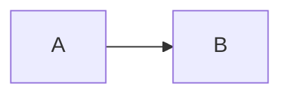

# Noema 自由排版：使用指南

Noema 借鉴了 [Adjustable Media](https://github.com/Yi-luo-hua/obsidian-adjustable-media) 的直接操作方式，但保存为 Noema 原有的 Markdown 图片、图表属性和 Org 环境。下面的操作适用于 Noema 的 Markdown 编辑器；无需安装 Obsidian 插件。

## 从编辑器创建

- 选中几段文字、图片、表格或图表，右键选 **Arrange selection → Grid**。选中的完整行会进入排版组，原有 Markdown 保留。选 **Flowing text** 则让文字连续流入多栏。
- 在空白处右键选 **Insert layout → Grid / Flowing text**，然后在框内写 Markdown。
- 在图片、表格或图表上右键选 **Put in layout grid**，随后点排版组的 **Source**，在内容前后加入文字或其他图表。
- 使用编辑器 API 时，`runCommand("insert-layout", "grid")` 和 `runCommand("insert-layout", "flow")` 也支持选区。Quick Insert API 提供 *Layout grid* 和 *Flowing text columns* 两项。

排版组示例：

```markdown
#+begin layout {cols=2 mode=grid widths=55-45}
这里是图片左侧的正文。

{width=100%}

| 情况 | 数值 |
|---|---:|
| A | 1 |

这里是第二行右侧的补充说明。
#+end layout
```

`grid` 按 Markdown 顶层块从左到右、从上到下排。两个栏时第 1、2 块在第一行，第 3、4 块在第二行；空行分开的段落是不同块。`cols` 可设为 `2`、`3`、`4`，`widths` 用连字符给出各栏权重。窄窗口自动叠为一栏。`mode=flow` 适合连续正文；它使用浏览器文字分栏，块的最终高度由浏览器决定。

悬停排版组会显示 **2 / 3 / 4、Flow、Grid、Auto、Balance、Source**。前几项改栏数或模式；**Auto** 估算正文适合的栏数，**Balance** 估算各栏宽度；**Source** 回到 Markdown 编辑。直接点网格中的文字或图片，会在对应块的 Markdown 处打开源码。拖动网格栏间的分隔线可调宽度，聚焦后用左右方向键也可调整；拖动块上的 **⠿** 可以换位置，或用 `Alt` 加方向键。所有操作写回同一份源文件，可撤销。

## 单个图表的布局

图片直接在原生 Markdown 后加属性：

```markdown
{align=right width=50% height=240px}
```

`align=left|center|right` 设置对齐；`wrap=left|right` 让后续正文绕排；`width` 和 `height` 设置尺寸。图旁正文仍是普通 Markdown：

```markdown
{wrap=left width=40%}

这一段正文在图片旁排版，超过图片高度后回到整行宽度。
```

表格和 Mermaid 图把属性行紧贴块尾，TikZ 图把属性放在 `#+begin tikz` 行：

````markdown
| 项目 | 数值 |
|---|---:|
| A | 1 |
{wrap=right width=48%}


{align=center width=75%}

#+begin tikz diagram {align=left width=50%}
\draw (0,0) -- (1,1);
#+end tikz
````

在这些图表上悬停，用 **L / C / R** 对齐，**◧ / ◨** 绕排，**25% / 50% / 75% / 100% / Auto** 设宽度；拖动边缘手柄设尺寸，点 **↔** 把相邻图表并排。拖动 **⠿** 或用 `Alt+↑/↓` 可交换相邻的整块图表。右键的 **Layout** 菜单提供相同的对齐和宽度操作。并排和交换只处理源码中相邻的图表，不跨过正文。

## 一行多图

把最多四张普通 Markdown 图片写在同一行，或在一张图的悬浮工具栏点 **↔**，与下一张相邻图片合并：

```markdown
 
```

拖两图间的分隔线调整比例，拖底边调整整行高度；拖图片上的 **⋮⋮** 调整顺序，或用 `Alt+←/→`。双击图片可放大查看，滚轮缩放、拖动平移、左右方向键切图、`Esc` 关闭。

## 目前的能力边界

Noema 已支持上述网格、多栏、图文并排、绕排、尺寸与局部拖动，但还没有 Adjustable Media 的跨排版组拖入、整框自由拖移、单图磁吸定位、在预览内直接编辑文字、自动编号的图表/公式引用、专用视频拖动控件。现有视频嵌入保持 Noema 原有交互。不要把上游 Obsidian 的 `<!-- vml -->` 示例直接贴入 Noema；Noema 使用本页的源格式。
